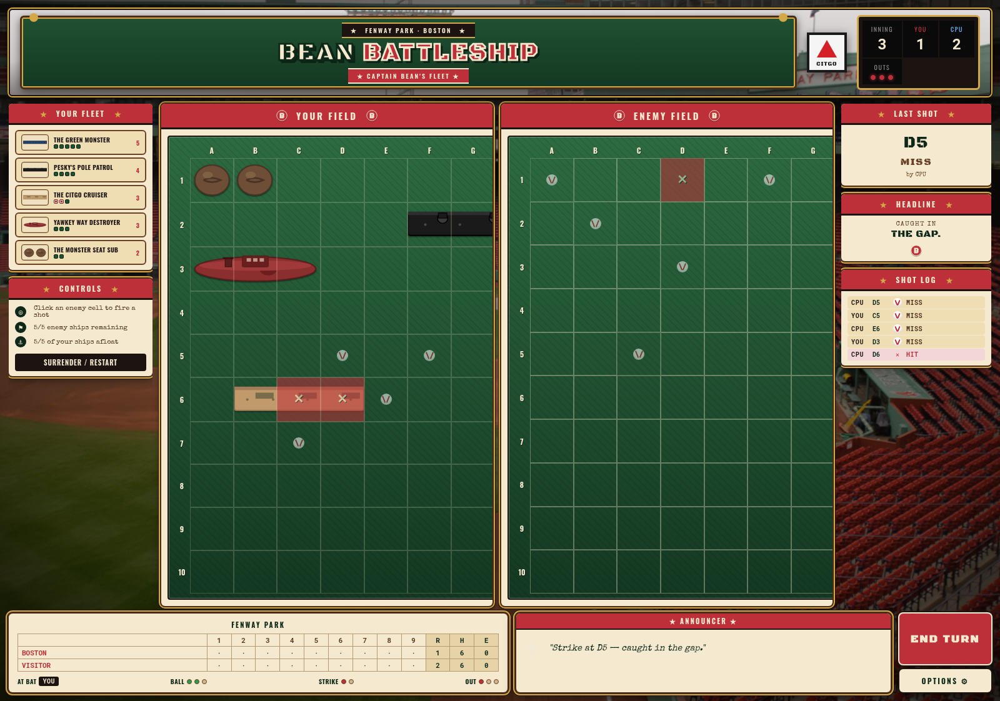

# ⚾ Bean Battleship

Fenway Park-themed Battleship built with React, TypeScript, and Vite. Play against a CPU on a 10×10 board with two difficulty levels — Regular Season or World Series.



## How to play

1. Pick a difficulty on the landing screen, then click **PLAY BALL**.
2. Place your fleet on the field. Click a ship card, then click a cell to drop it. Press `R` to rotate. Ships can't touch — not even at corners.
3. Once all five ships are placed, hit **PLAY BALL** again to start the game.
4. Click cells on the enemy field to fire. First fleet sunk loses.
5. After the game, hit **NEW GAME** to head back to the landing screen.

The mini-scoreboard at the bottom reflects real game state: per-inning hit splits, R/H/E, balls/strikes/outs derived from your shots.

## Fleet

- **The Green Monster** (5)
- **Pesky's Pole Patrol** (4)
- **The Citgo Cruiser** (3)
- **Yawkey Way Destroyer** (3)
- **The Monster Seat Sub** (2)

## AI difficulty

- **Regular Season** — randomized hunt, neighbor-target on a hit.
- **World Series** — probability-weighted heatmap targeting, line-lock after 2 collinear hits, exploits the no-touch rule by auto-marking 8-neighbors of sunk ships.

## Run locally

```bash
npm install
npm run dev
```

If `localhost` has issues, try `http://127.0.0.1:5173`.

## Scripts

| Command | What it does |
| --- | --- |
| `npm run dev` | Vite dev server |
| `npm run build` | TypeScript build + production bundle |
| `npm run preview` | Preview the production bundle |
| `npm test` | Run vitest (unit + RTL flow tests) |
| `npm run test:watch` | Vitest watch mode |
| `npm run test:e2e` | Run Playwright end-to-end tests |
| `npm run test:all` | Run both vitest and Playwright |

## Tests

- `src/tests/board.test.ts` — board / placement / shot logic (3 specs)
- `src/tests/ai.test.ts` — AI hunt + target behavior (3 specs)
- `src/tests/flow.test.tsx` — RTL integration of the full app flow (6 specs)
- `e2e/app.spec.ts` — Playwright real-browser smoke tests (7 specs)

## Tech stack

- React 18 + TypeScript
- Vite (dev + build)
- Vanilla CSS (no UI framework) — custom Fenway theme
- Vitest + Testing Library + Playwright
- 100% client-side, no backend, no env vars

## Deploy

See [`DEPLOY.md`](./DEPLOY.md) for Netlify / Vercel / GH Pages instructions.

## Project structure

```
src/
  App.tsx              — main game component (landing, setup, play, game-over)
  main.tsx             — entry point
  styles.css           — all styling, Fenway theme
  types.ts             — TypeScript interfaces
  components/
    HeaderBrand.tsx
    ShipIcon.tsx
  utils/
    board.ts           — board state, placement, shot logic
    ai.ts              — AI opponent (moderate/hard)
  tests/
    board.test.ts
    ai.test.ts
    flow.test.tsx
    setup.ts
e2e/
  app.spec.ts          — Playwright smoke
public/
  hero.jpg             — Fenway backdrop
  stadium.jpg
docs/
  screenshots/
```

## License

Personal project — no license attached.
